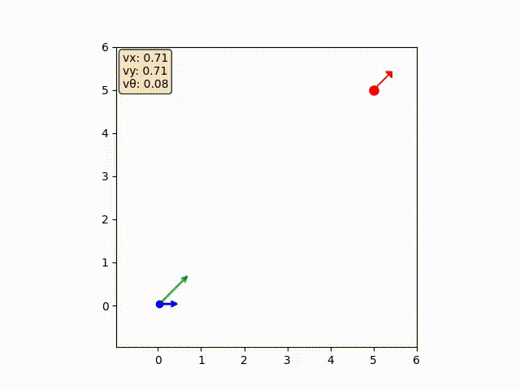
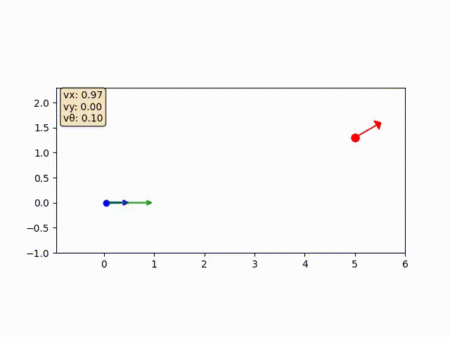

# 追踪模拟
这是一个用于模拟2D追踪场景的 Python 项目，使用 Jupyter Notebook 进行可视化和动画展示。用户可以自定义控制器类，并通过模拟生成追踪动画。

## 功能
- 使用可调参数模拟跟踪场景。
- 以动画形式可视化模拟结果。
- 支持自定义用例。

## 安装
1. 克隆仓库：
    ```bash
    git clone https://github.com/yourusername/track_sim.git
    ```
2. 进入项目目录：
    ```bash
    cd track_sim
    ```
3. 安装依赖：
    ```bash
    pip install -r requirements.txt
    ```

## 使用方法
打开track.ipynb文件，按照以下步骤进行模拟：
1. 自定义控制器类。
2. 定义初始位姿和目标位姿。
3. 激活Jupyter核心。
4. 全部运行以生成模拟动画。

## 示例动画
以下是模拟生成的示例动画：




## 贡献
欢迎贡献！请 fork 仓库并提交 pull request。

## 许可证
本项目基于 MIT 许可证授权。详情请参阅 [LICENSE](LICENSE) 文件。